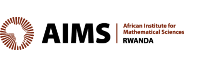

# Data Science Capacity Building Initiative (DSCBI)

<div style="display: flex; justify-content: space-between; align-items: center; margin-bottom: 20px;">
    
    
    
</div>

This is the online documentation for the capacity building initiative, a collaboration between the African Institute for Mathematical Sciences (AIMS), the National Institute of Statistics of Rwanda (NISR), and [Cenfri](https://cenfri.org). The initiative aims to deliver data science training to staff from over 20 institutions that are part of Rwanda's National Statistical System (NSS).

## About This Course

This site contains all course materials, modules, and resources for participants in the Data Science Capacity Building Initiative. Navigate through the sections to access the course content, requirements, and notebook examples.

```{tableofcontents}
```
